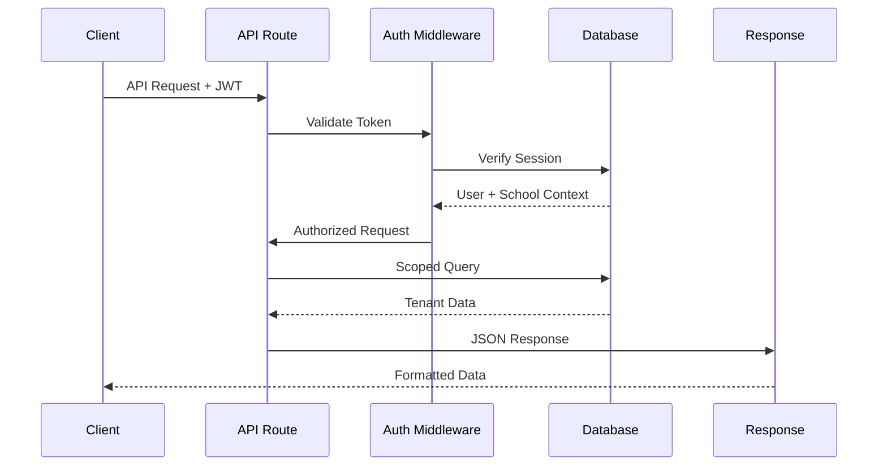

# StudyStreaks API Design

## Overview

The StudyStreaks API is built using Next.js API Routes with a focus on type safety, multi-tenancy, and GDPR compliance. The API follows RESTful principles while providing GraphQL-like type safety through TypeScript and Prisma integration.

## API Architecture

### Core Design Principles

1. **Type Safety**: End-to-end TypeScript with runtime validation
2. **Multi-Tenant**: All endpoints automatically scoped to school context
3. **Security First**: Authentication and authorization on every endpoint
4. **GDPR Compliant**: Privacy controls and audit logging built-in
5. **Performance**: Optimized queries with caching and pagination

### Technology Stack

- **Next.js API Routes**: Serverless API endpoints with hot reloading
- **Prisma**: Type-safe database queries with automatic migrations
- **Zod**: Runtime type validation and schema enforcement
- **NextAuth.js**: Secure authentication with JWT tokens
- **next-safe-action**: Type-safe server actions with validation

## Authentication & Authorization

### Authentication Flow



### Authorization Model

```typescript
// Role-based permission checking
interface APIContext {
  user: {
    id: string;
    schoolId: string;
    roles: Role[];
  };
  permissions: Permission[];
  tenantContext: {
    schoolId: string;
    settings: SchoolSettings;
  };
}

// Permission validation middleware
const requirePermission = (permission: string) => {
  return (context: APIContext) => {
    return context.permissions.some(p => 
      p.name === permission && p.isActive
    );
  };
};
```

## API Structure

### Base URL Structure
```
/api/v1/{resource}/{action}
/api/v1/{resource}/{id}
/api/v1/{resource}/{id}/{sub-resource}
```

### Standard Response Format

```typescript
interface APIResponse<T> {
  success: boolean;
  data?: T;
  error?: {
    code: string;
    message: string;
    details?: Record<string, any>;
  };
  pagination?: {
    page: number;
    limit: number;
    total: number;
    hasNext: boolean;
    hasPrev: boolean;
  };
  meta?: {
    timestamp: string;
    requestId: string;
    version: string;
  };
}
```

## Core API Endpoints

### 1. Authentication & Session Management

#### POST /api/auth/signin
```typescript
interface SignInRequest {
  email: string;
  password: string;
  rememberMe?: boolean;
}

interface SignInResponse {
  user: {
    id: string;
    email: string;
    schoolId: string;
    roles: string[];
  };
  session: {
    token: string;
    expires: string;
  };
}
```

#### GET /api/auth/session
```typescript
interface SessionResponse {
  user: UserProfile;
  school: SchoolContext;
  permissions: Permission[];
  expires: string;
}
```

### 2. User Management

#### GET /api/v1/users
```typescript
interface GetUsersQuery {
  page?: number;
  limit?: number;
  role?: UserRole;
  search?: string;
  isActive?: boolean;
}

interface GetUsersResponse {
  users: UserProfile[];
  pagination: PaginationInfo;
}
```

#### POST /api/v1/users
```typescript
interface CreateUserRequest {
  email: string;
  role: UserRole;
  profile: {
    firstName: string;
    lastName: string;
    // Role-specific fields
  };
  permissions?: string[];
}
```

### 3. Student Management

#### GET /api/v1/students
```typescript
interface GetStudentsQuery {
  classId?: string;
  yearGroup?: number;
  parentId?: string; // For parent access
  search?: string;
  page?: number;
  limit?: number;
}

interface StudentProfile {
  id: string;
  firstName: string;
  lastName: string;
  yearGroup: number;
  classId: string;
  className: string;
  parentLinks: ParentLink[];
  homeworkStats: HomeworkStats;
  streakInfo: StreakInfo;
}
```

#### POST /api/v1/students
```typescript
interface CreateStudentRequest {
  firstName: string;
  lastName: string;
  dateOfBirth: string;
  yearGroup: number;
  classId: string;
  parentConsent: {
    consentGiven: boolean;
    consentGivenBy: string;
    consentDate: string;
  };
  // Additional profile fields
}
```

### 4. Homework & Club Management

#### GET /api/v1/clubs
```typescript
interface GetClubsQuery {
  subject?: string;
  ageGroups?: number[];
  isActive?: boolean;
}

interface ClubInfo {
  id: string;
  name: string;
  subject: string;
  description: string;
  ageGroups: number[];
  levelSystem: LevelInfo[];
  participantCount: number;
  completionStats: CompletionStats;
}
```

#### POST /api/v1/homework/submit
```typescript
interface SubmitHomeworkRequest {
  studentId: string;
  clubId: string;
  evidenceType: EvidenceType;
  evidenceUrl?: string;
  notes?: string;
  timeSpentMinutes?: number;
  buddyGroupId?: string;
}

interface SubmitHomeworkResponse {
  completion: HomeworkCompletion;
  streakUpdate: StreakUpdate;
  pointsEarned: number;
  badgesEarned?: Badge[];
}
```

### 5. Progress & Analytics

#### GET /api/v1/analytics/student/{studentId}
```typescript
interface StudentAnalytics {
  overview: {
    totalCompletions: number;
    currentStreak: number;
    longestStreak: number;
    totalPoints: number;
    badgeCount: number;
  };
  subjectProgress: SubjectProgress[];
  recentActivity: RecentActivity[];
  trendData: TrendDataPoint[];
}
```

#### GET /api/v1/analytics/class/{classId}
```typescript
interface ClassAnalytics {
  overview: ClassOverview;
  studentProgress: StudentProgress[];
  subjectBreakdown: SubjectBreakdown[];
  engagementMetrics: EngagementMetrics;
  complianceStatus: ComplianceStatus;
}
```

## Multi-Tenant Implementation

### Tenant Context Middleware

```typescript
// Automatic tenant scoping middleware
export const withTenantContext = (handler: APIHandler) => {
  return async (req: NextApiRequest, res: NextApiResponse) => {
    const session = await getServerSession(req, res, authOptions);
    
    if (!session?.user?.schoolId) {
      return res.status(401).json({
        success: false,
        error: { code: 'UNAUTHORIZED', message: 'Invalid session' }
      });
    }

    // Set tenant context for database queries
    await prisma.$executeRaw`SET app.current_tenant = ${session.user.schoolId}`;
    
    // Add tenant context to request
    req.tenantContext = {
      schoolId: session.user.schoolId,
      userId: session.user.id,
      userRoles: session.user.roles
    };

    return handler(req, res);
  };
};
```

### Data Isolation

```typescript
// Automatic tenant scoping in queries
const getTenantClient = (schoolId: string) => {
  return {
    ...prisma,
    // Override default methods to include tenant filtering
    user: {
      ...prisma.user,
      findMany: (args) => prisma.user.findMany({
        ...args,
        where: { ...args?.where, schoolId }
      })
    }
    // ... other models
  };
};
```

## Input Validation & Type Safety

### Request Validation

```typescript
import { z } from 'zod';

// Schema definitions
const CreateStudentSchema = z.object({
  firstName: z.string().min(1).max(50),
  lastName: z.string().min(1).max(50),
  dateOfBirth: z.string().datetime(),
  yearGroup: z.number().min(0).max(6),
  classId: z.string().uuid(),
  parentConsent: z.object({
    consentGiven: z.boolean(),
    consentGivenBy: z.string().uuid(),
    consentDate: z.string().datetime()
  })
});

// Type-safe API handler
export default async function handler(
  req: NextApiRequest,
  res: NextApiResponse<APIResponse<Student>>
) {
  try {
    const data = CreateStudentSchema.parse(req.body);
    const student = await createStudent(data);
    
    res.status(201).json({
      success: true,
      data: student
    });
  } catch (error) {
    if (error instanceof z.ZodError) {
      res.status(400).json({
        success: false,
        error: {
          code: 'VALIDATION_ERROR',
          message: 'Invalid input data',
          details: error.errors
        }
      });
    }
  }
}
```

## Error Handling

### Standard Error Codes

```typescript
enum APIErrorCode {
  // Authentication & Authorization
  UNAUTHORIZED = 'UNAUTHORIZED',
  FORBIDDEN = 'FORBIDDEN',
  INVALID_TOKEN = 'INVALID_TOKEN',
  
  // Validation
  VALIDATION_ERROR = 'VALIDATION_ERROR',
  MISSING_REQUIRED_FIELD = 'MISSING_REQUIRED_FIELD',
  INVALID_FORMAT = 'INVALID_FORMAT',
  
  // Business Logic
  INSUFFICIENT_PERMISSIONS = 'INSUFFICIENT_PERMISSIONS',
  RESOURCE_NOT_FOUND = 'RESOURCE_NOT_FOUND',
  DUPLICATE_RESOURCE = 'DUPLICATE_RESOURCE',
  
  // GDPR & Compliance
  CONSENT_REQUIRED = 'CONSENT_REQUIRED',
  DATA_RETENTION_VIOLATION = 'DATA_RETENTION_VIOLATION',
  PRIVACY_VIOLATION = 'PRIVACY_VIOLATION',
  
  // System
  INTERNAL_ERROR = 'INTERNAL_ERROR',
  SERVICE_UNAVAILABLE = 'SERVICE_UNAVAILABLE',
  RATE_LIMIT_EXCEEDED = 'RATE_LIMIT_EXCEEDED'
}
```

### Error Response Format

```typescript
interface APIError {
  code: APIErrorCode;
  message: string;
  details?: Record<string, any>;
  timestamp: string;
  requestId: string;
  path: string;
}
```

## Rate Limiting & Security

### Rate Limiting Implementation

```typescript
// Rate limiting middleware
const rateLimiter = rateLimit({
  windowMs: 15 * 60 * 1000, // 15 minutes
  max: 100, // Limit each IP to 100 requests per windowMs
  message: {
    success: false,
    error: {
      code: 'RATE_LIMIT_EXCEEDED',
      message: 'Too many requests, please try again later'
    }
  },
  standardHeaders: true,
  legacyHeaders: false,
});
```

### CORS Configuration

```typescript
// CORS settings for educational platform
const corsOptions = {
  origin: process.env.NODE_ENV === 'production' 
    ? ['https://studystreaks.co.uk', 'https://admin.studystreaks.co.uk']
    : ['http://localhost:3000', 'http://localhost:3001'],
  credentials: true,
  optionsSuccessStatus: 200
};
```

## Real-time Features

### WebSocket API Design

```typescript
// Socket.io event structure
interface SocketEvents {
  // Homework completion updates
  'homework:completed': {
    studentId: string;
    clubId: string;
    completion: HomeworkCompletion;
    streakUpdate: StreakUpdate;
  };
  
  // Real-time leaderboard updates
  'leaderboard:updated': {
    classId: string;
    leaderboard: LeaderboardEntry[];
  };
  
  // Badge achievements
  'badge:earned': {
    studentId: string;
    badge: Badge;
    achievementDate: string;
  };
}

// Tenant-scoped event handling
io.use((socket, next) => {
  const token = socket.handshake.auth.token;
  const user = verifyJWT(token);
  
  if (user) {
    socket.join(`school:${user.schoolId}`);
    socket.data.user = user;
    next();
  } else {
    next(new Error('Authentication error'));
  }
});
```

## API Documentation & Testing

### OpenAPI Specification

```yaml
openapi: 3.0.0
info:
  title: StudyStreaks API
  version: 1.0.0
  description: Gamified homework platform for UK primary schools
  
security:
  - bearerAuth: []
  
paths:
  /api/v1/students:
    get:
      summary: Get students list
      parameters:
        - name: classId
          in: query
          schema:
            type: string
            format: uuid
      responses:
        '200':
          description: Students list retrieved successfully
          content:
            application/json:
              schema:
                $ref: '#/components/schemas/StudentsResponse'
```

### Integration Testing

```typescript
// API endpoint testing
describe('/api/v1/students', () => {
  beforeEach(async () => {
    await setupTestDatabase();
    await authenticateTestUser();
  });

  it('should return students for authenticated teacher', async () => {
    const response = await request(app)
      .get('/api/v1/students')
      .set('Authorization', `Bearer ${teacherToken}`)
      .expect(200);

    expect(response.body.success).toBe(true);
    expect(response.body.data).toHaveLength(25);
  });

  it('should enforce tenant isolation', async () => {
    const response = await request(app)
      .get('/api/v1/students')
      .set('Authorization', `Bearer ${otherSchoolToken}`)
      .expect(200);

    expect(response.body.data).toHaveLength(0);
  });
});
```

This API design ensures type safety, security, and compliance while providing a robust foundation for the StudyStreaks educational platform.