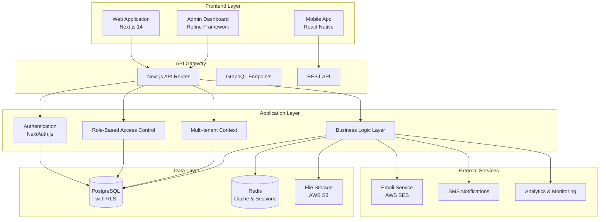
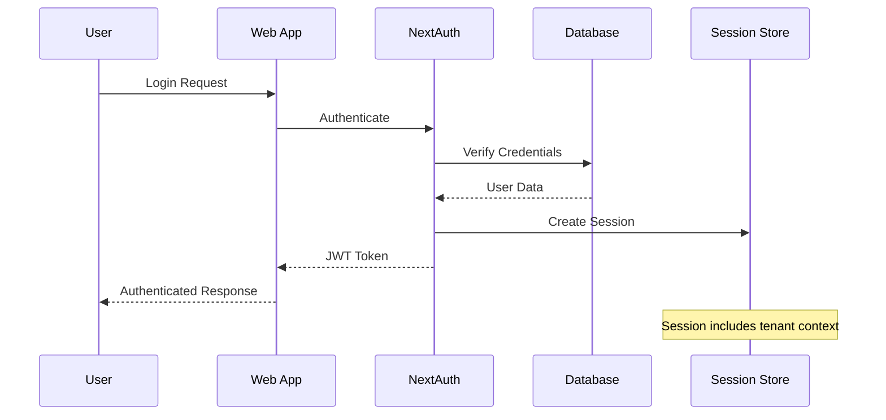

# StudyStreaks System Architecture Overview

## System Architecture

StudyStreaks is built as a modern, scalable web application using a multi-tenant architecture designed specifically for UK primary schools. The platform emphasizes security, compliance, and age-appropriate design while maintaining high performance and reliability.

### High-Level Architecture



## Core Architectural Principles

### 1. Multi-Tenancy
- **Tenant Isolation**: Each school operates as a separate tenant with complete data isolation
- **Row Level Security (RLS)**: Database-level security ensuring no cross-tenant data access
- **Tenant Context**: All operations automatically scoped to the current school context
- **Scalability**: Single codebase serves multiple schools efficiently

### 2. Security-First Design
- **GDPR Compliance**: Built-in data protection and privacy controls
- **ICO Children's Code**: Age-appropriate design and data handling
- **Authentication**: JWT-based authentication with secure session management
- **Authorization**: Granular role-based permissions system
- **Data Encryption**: Sensitive data encrypted at rest and in transit

### 3. Microservices Architecture (Logical)
- **Modular Design**: Clear separation of concerns within the monolith
- **Service Boundaries**: Well-defined interfaces between components
- **Event-Driven**: Real-time updates through WebSocket connections
- **Background Jobs**: Asynchronous processing for heavy operations

## Technology Stack

### Frontend Technologies
- **Next.js 14**: React framework with App Router and SSR/SSG
- **TypeScript**: Type-safe development across the entire stack
- **Tailwind CSS**: Utility-first CSS framework for consistent styling
- **Shadcn/ui**: High-quality, accessible component library
- **Framer Motion**: Smooth animations for gamification features

### Backend Technologies
- **Next.js API Routes**: Serverless API endpoints with type safety
- **Prisma ORM**: Type-safe database access with excellent developer experience
- **NextAuth.js**: Complete authentication solution with multiple providers
- **PostgreSQL**: Robust relational database with advanced features
- **Redis**: High-performance caching and session storage

### Infrastructure & DevOps
- **Nx Monorepo**: Efficient workspace management and build optimization
- **Docker**: Containerized development and deployment
- **Vercel**: Edge deployment platform for optimal performance
- **AWS**: Production infrastructure for scalability and reliability

## Data Architecture

### Multi-Tenant Data Model

```mermaid
erDiagram
    School ||--o{ User : contains
    School ||--o{ Class : has
    School ||--o{ Club : offers
    
    User ||--o{ Teacher : "can be"
    User ||--o{ Student : "can be"
    User ||--o{ Parent : "can be"
    User ||--o{ SchoolAdmin : "can be"
    
    Class ||--o{ Student : enrolls
    Class ||--o{ TeacherClass : "taught by"
    
    Club ||--o{ HomeworkCompletion : tracks
    Student ||--o{ HomeworkCompletion : submits
    
    Teacher ||--o{ TeacherClass : teaches
    Parent ||--o{ ParentStudent : "guardian of"
    Student ||--o{ ParentStudent : "child of"
```

### Data Isolation Strategy
- **Schema-level Isolation**: Each tenant's data is logically separated
- **Row Level Security**: PostgreSQL RLS policies enforce tenant boundaries
- **Application-level Checks**: Multiple layers of security validation
- **Audit Trails**: Comprehensive logging for compliance and security

## Security Architecture

### Authentication Flow



### Authorization Model
- **Role-Based Access Control (RBAC)**: Granular permissions per role
- **Resource-Level Permissions**: Access control at data entity level
- **Tenant Scoping**: All permissions automatically scoped to school
- **Dynamic Permissions**: Context-aware authorization decisions

## Performance Architecture

### Caching Strategy
- **Application Cache**: Redis for frequently accessed data
- **Database Query Cache**: Prisma query result caching
- **Static Asset Cache**: CDN caching for images and files
- **Browser Cache**: Optimized client-side caching headers

### Real-time Features
- **WebSocket Connections**: Socket.io for real-time updates
- **Event Broadcasting**: Tenant-scoped event distribution
- **Optimistic Updates**: Immediate UI feedback with background sync
- **Connection Management**: Efficient connection pooling and cleanup

## Scalability Considerations

### Horizontal Scaling
- **Stateless Application**: Enables horizontal scaling across instances
- **Database Connection Pooling**: Efficient database resource utilization
- **CDN Integration**: Global content delivery for optimal performance
- **Load Balancing**: Distributed traffic handling

### Vertical Scaling
- **Database Optimization**: Efficient queries and indexing strategies
- **Memory Management**: Optimized caching and garbage collection
- **Background Processing**: Asynchronous job handling for heavy operations

## Compliance Architecture

### GDPR Implementation
- **Data Minimization**: Collect only necessary educational data
- **Purpose Limitation**: Clear data usage boundaries and purposes
- **Storage Limitation**: Automated data retention and deletion
- **Consent Management**: Granular consent tracking and withdrawal

### ICO Children's Code
- **Age-Appropriate Design**: UI/UX tailored for primary school children
- **Data Protection by Design**: Privacy-first architecture decisions
- **Parental Controls**: Comprehensive oversight and management tools
- **Transparency**: Clear, understandable privacy communications

## Monitoring & Observability

### Application Monitoring
- **Error Tracking**: Comprehensive error logging and alerting
- **Performance Monitoring**: Real-time performance metrics
- **User Analytics**: Privacy-compliant usage analytics
- **Health Checks**: Automated system health monitoring

### Security Monitoring
- **Access Logging**: Comprehensive audit trails
- **Anomaly Detection**: Unusual access pattern identification
- **Compliance Reporting**: Automated compliance status reporting
- **Incident Response**: Structured security incident handling

## Deployment Architecture

### Environment Strategy
- **Development**: Local Docker environment with hot reloading
- **Staging**: Production-like environment for testing
- **Production**: High-availability deployment with redundancy

### CI/CD Pipeline
- **Automated Testing**: Comprehensive test suite execution
- **Code Quality Gates**: Linting, formatting, and security checks
- **Database Migrations**: Safe, automated schema updates
- **Zero-Downtime Deployment**: Blue-green deployment strategy

This architecture provides a robust foundation for StudyStreaks to serve UK primary schools while maintaining the highest standards of security, performance, and compliance.