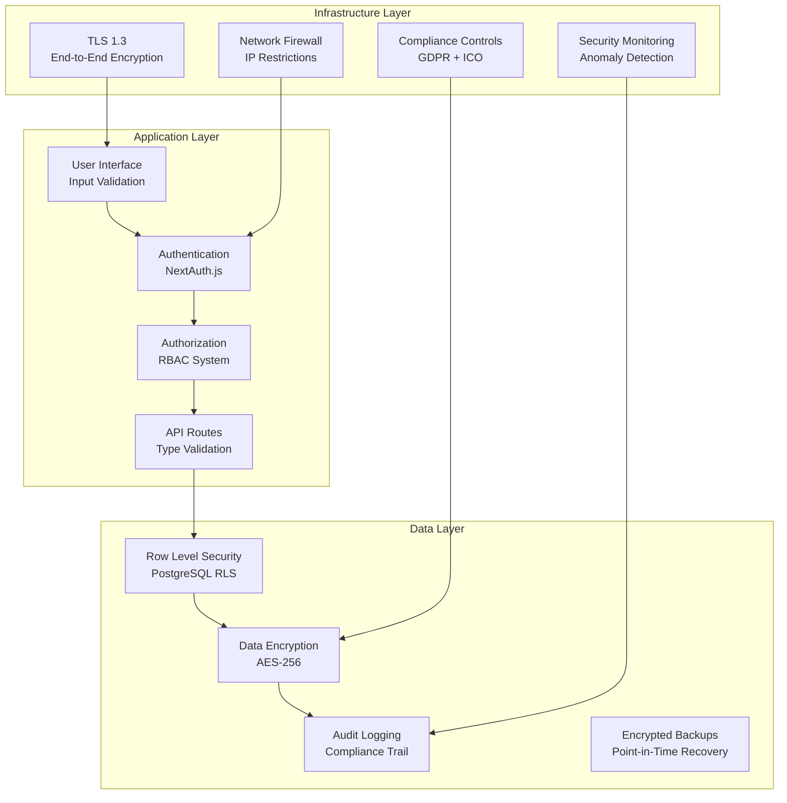

# StudyStreaks Security Model

## Overview

The StudyStreaks security model is designed specifically for UK primary education, incorporating GDPR compliance, ICO Children's Code requirements, and multi-tenant data isolation. Security is implemented through multiple layers from the database to the user interface.

## Security Architecture

### Defense in Depth Strategy



## Authentication System

### Multi-Factor Authentication

```typescript
interface AuthenticationConfig {
  primaryAuth: {
    method: 'email_password' | 'sso' | 'magic_link';
    passwordPolicy: PasswordPolicy;
    sessionManagement: SessionConfig;
  };
  secondaryAuth?: {
    enabled: boolean;
    methods: ['sms', 'email', 'totp'];
    required_for: UserRole[];
  };
  socialAuth: {
    providers: ['google', 'microsoft'];
    schoolDomainRestriction: boolean;
  };
}

interface PasswordPolicy {
  minLength: 12;
  requireUppercase: true;
  requireLowercase: true;
  requireNumbers: true;
  requireSpecialChars: true;
  preventCommonPasswords: true;
  preventPersonalInfo: true;
  maxAge: 90; // days
}
```

### Session Management

```typescript
interface SessionSecurity {
  jwtConfig: {
    algorithm: 'RS256';
    issuer: 'studystreaks.co.uk';
    audience: 'studystreaks-api';
    expirationTime: '2h';
    refreshTokenExpiry: '30d';
  };
  sessionStorage: {
    type: 'redis';
    encryption: 'AES-256-GCM';
    sameSite: 'strict';
    secure: true;
    httpOnly: true;
  };
  inactivityTimeout: 30; // minutes
  concurrentSessionLimit: 3;
}
```

## Authorization Framework

### Role-Based Access Control (RBAC)

```typescript
enum UserRole {
  SUPER_ADMIN = 'super_admin',
  SCHOOL_ADMIN = 'school_admin',
  HEAD_TEACHER = 'head_teacher',
  TEACHER = 'teacher',
  TEACHING_ASSISTANT = 'teaching_assistant',
  PARENT = 'parent',
  STUDENT = 'student'
}

interface Permission {
  resource: string; // 'students', 'homework', 'clubs', 'analytics'
  action: string;   // 'read', 'write', 'delete', 'manage'
  scope: string;    // 'own', 'class', 'school', 'all'
  conditions?: PermissionCondition[];
}

interface PermissionCondition {
  field: string;
  operator: 'equals' | 'in' | 'not_in' | 'greater_than';
  value: any;
}
```

### Dynamic Authorization

```typescript
// Context-aware permission checking
class AuthorizationService {
  async hasPermission(
    user: User,
    resource: string,
    action: string,
    context: AuthContext
  ): Promise<boolean> {
    // 1. Check role-based permissions
    const rolePermissions = await this.getUserPermissions(user);
    
    // 2. Apply context-specific rules
    const contextualPermissions = this.applyContextRules(
      rolePermissions,
      context
    );
    
    // 3. Check GDPR consent requirements
    if (this.requiresConsent(resource, action)) {
      const hasConsent = await this.checkGDPRConsent(user, context);
      if (!hasConsent) return false;
    }
    
    // 4. Apply tenant isolation
    return this.validateTenantAccess(user, context);
  }
}
```

## Multi-Tenant Security

### Tenant Isolation Strategy

```sql
-- Database-level tenant isolation
CREATE POLICY tenant_isolation ON students
  FOR ALL TO authenticated_user
  USING (school_id = current_setting('app.current_tenant')::UUID);

-- Application-level validation
CREATE OR REPLACE FUNCTION validate_tenant_access()
RETURNS TRIGGER AS $$
BEGIN
  IF NEW.school_id != current_setting('app.current_tenant')::UUID THEN
    RAISE EXCEPTION 'Cross-tenant access violation';
  END IF;
  RETURN NEW;
END;
$$ LANGUAGE plpgsql;
```

### Tenant Context Management

```typescript
interface TenantContext {
  schoolId: string;
  userId: string;
  userRoles: Role[];
  permissions: Permission[];
  gdprSettings: GDPRSettings;
  auditContext: AuditContext;
}

// Middleware to enforce tenant context
export const withTenantSecurity = (handler: APIHandler) => {
  return async (req: NextApiRequest, res: NextApiResponse) => {
    const session = await getServerSession(req, res);
    
    // Validate session and extract tenant context
    const tenantContext = await validateAndExtractTenant(session);
    
    // Set database tenant context
    await prisma.$executeRaw`
      SET app.current_tenant = ${tenantContext.schoolId}
    `;
    
    // Attach to request for use in handlers
    req.tenantContext = tenantContext;
    
    return handler(req, res);
  };
};
```

## Data Protection & Privacy

### GDPR Compliance Implementation

```typescript
interface GDPRControls {
  dataMinimization: {
    collectOnlyNecessary: true;
    purposeLimitation: string[];
    storageMinimization: {
      retentionPeriod: number; // days
      automaticDeletion: boolean;
    };
  };
  
  consentManagement: {
    explicitConsent: boolean;
    granularConsent: boolean;
    easyWithdrawal: boolean;
    consentRecords: {
      who: string;
      when: Date;
      what: string[];
      how: string;
    };
  };
  
  subjectRights: {
    rightToAccess: boolean;
    rightToRectification: boolean;
    rightToErasure: boolean;
    rightToPortability: boolean;
    rightToRestriction: boolean;
  };
}
```

### ICO Children's Code Compliance

```typescript
interface ChildrensCodeCompliance {
  ageAppropriateDesign: {
    ui: 'child_friendly';
    language: 'simple_clear';
    defaultSettings: 'most_private';
    parentalControls: 'comprehensive';
  };
  
  dataProtectionByDesign: {
    privacyByDefault: true;
    noProfilingOrTracking: true;
    noGeolocation: true;
    noOnlineAdvertising: true;
    noNudgeTechniques: true;
  };
  
  parentalInvolvement: {
    consentRequired: true;
    ongoingOversight: true;
    transparentPolicies: true;
    easyToUnderstandTerms: true;
  };
}
```

### Data Encryption Standards

```typescript
interface EncryptionConfig {
  atRest: {
    algorithm: 'AES-256-GCM';
    keyManagement: 'AWS-KMS';
    databaseEncryption: 'TDE'; // Transparent Data Encryption
    fileEncryption: 'S3-SSE-KMS';
  };
  
  inTransit: {
    tlsVersion: '1.3';
    certificateAuthority: 'LetsEncrypt';
    hsts: true;
    certificatePinning: true;
  };
  
  applicationLevel: {
    piiFields: ['firstName', 'lastName', 'dateOfBirth'];
    algorithm: 'AES-256-GCM';
    keyRotation: 90; // days
    deterministicEncryption: false;
  };
}
```

## Input Validation & Sanitization

### Comprehensive Input Validation

```typescript
import { z } from 'zod';

// UK-specific validation schemas
const UKPostcodeSchema = z.string().regex(
  /^[A-Z]{1,2}[0-9R][0-9A-Z]? [0-9][A-Z]{2}$/,
  'Invalid UK postcode format'
);

const UKPhoneSchema = z.string().regex(
  /^(\+44|0)[1-9]\d{8,9}$/,
  'Invalid UK phone number format'
);

// Educational data validation
const YearGroupSchema = z.number().min(0).max(6); // Reception to Year 6
const StudentNameSchema = z.string()
  .min(1, 'Name is required')
  .max(50, 'Name too long')
  .regex(/^[a-zA-Z\s\-']+$/, 'Invalid characters in name');

// File upload validation
const HomeworkEvidenceSchema = z.object({
  type: z.enum(['photo', 'audio', 'document']),
  size: z.number().max(5 * 1024 * 1024), // 5MB limit
  mimetype: z.enum([
    'image/jpeg', 'image/png', 'image/webp',
    'audio/mpeg', 'audio/wav',
    'application/pdf'
  ])
});
```

### XSS Prevention

```typescript
// Content Security Policy
const cspConfig = {
  directives: {
    defaultSrc: ["'self'"],
    scriptSrc: ["'self'", "'unsafe-inline'"], // Minimal inline scripts
    styleSrc: ["'self'", "'unsafe-inline'"],
    imgSrc: ["'self'", "data:", "https://studystreaks-assets.s3.amazonaws.com"],
    fontSrc: ["'self'", "https://fonts.gstatic.com"],
    connectSrc: ["'self'", "https://api.studystreaks.co.uk"],
    frameSrc: ["'none'"],
    objectSrc: ["'none'"],
    baseUri: ["'self'"],
    formAction: ["'self'"]
  }
};

// Input sanitization
import DOMPurify from 'isomorphic-dompurify';

const sanitizeUserInput = (input: string): string => {
  return DOMPurify.sanitize(input, {
    ALLOWED_TAGS: [], // No HTML tags allowed
    ALLOWED_ATTR: [],
    KEEP_CONTENT: true
  });
};
```

## Security Monitoring & Incident Response

### Real-time Security Monitoring

```typescript
interface SecurityMonitoring {
  failedLoginAttempts: {
    threshold: 5;
    timeWindow: 15; // minutes
    action: 'temporary_lockout';
    duration: 30; // minutes
  };
  
  unusualAccessPatterns: {
    multipleLocationLogins: boolean;
    offHoursAccess: boolean;
    bulkDataAccess: boolean;
    adminPrivilegeEscalation: boolean;
  };
  
  dataAccessAnomalies: {
    crossTenantAttempts: boolean;
    unauthorizedDataExports: boolean;
    suspiciousQueryPatterns: boolean;
    gdprViolationAttempts: boolean;
  };
}
```

### Audit Logging

```typescript
interface AuditLog {
  id: string;
  timestamp: Date;
  
  // User context
  userId: string;
  schoolId: string;
  userAgent: string;
  ipAddress: string;
  sessionId: string;
  
  // Action details
  action: AuditAction;
  resource: string;
  resourceId?: string;
  oldValues?: Record<string, any>;
  newValues?: Record<string, any>;
  
  // Compliance tracking
  gdprLawfulBasis?: string;
  dataSubjectId?: string;
  consentStatus?: boolean;
  
  // Security context
  riskLevel: 'low' | 'medium' | 'high' | 'critical';
  securityFlags: string[];
}

enum AuditAction {
  CREATE = 'CREATE',
  READ = 'READ',
  UPDATE = 'UPDATE',
  DELETE = 'DELETE',
  LOGIN = 'LOGIN',
  LOGOUT = 'LOGOUT',
  PERMISSION_CHANGE = 'PERMISSION_CHANGE',
  EXPORT = 'EXPORT',
  CONSENT_GIVEN = 'CONSENT_GIVEN',
  CONSENT_WITHDRAWN = 'CONSENT_WITHDRAWN'
}
```

### Incident Response Plan

```typescript
interface IncidentResponse {
  detection: {
    automatedAlerts: boolean;
    manualReporting: boolean;
    thirdPartyNotifications: boolean;
  };
  
  classification: {
    severity: 'low' | 'medium' | 'high' | 'critical';
    category: 'data_breach' | 'unauthorized_access' | 'system_compromise';
    gdprReportable: boolean;
    icoNotificationRequired: boolean;
  };
  
  response: {
    immediateActions: string[];
    containmentProcedures: string[];
    forensicAnalysis: boolean;
    userNotification: {
      required: boolean;
      timeline: number; // hours
      method: 'email' | 'portal' | 'letter';
    };
  };
  
  recovery: {
    systemRestoration: string[];
    dataRecovery: string[];
    securityEnhancements: string[];
    postIncidentReview: boolean;
  };
}
```

## Vulnerability Management

### Security Testing

```typescript
interface SecurityTesting {
  staticAnalysis: {
    tools: ['SonarQube', 'CodeQL', 'Snyk'];
    frequency: 'every_commit';
    failBuild: true;
  };
  
  dynamicAnalysis: {
    tools: ['OWASP ZAP', 'Burp Suite'];
    frequency: 'weekly';
    scope: ['api_endpoints', 'authentication_flows'];
  };
  
  dependencyScanning: {
    tools: ['npm audit', 'Snyk', 'WhiteSource'];
    frequency: 'daily';
    autoUpdate: 'security_patches_only';
  };
  
  penetrationTesting: {
    frequency: 'quarterly';
    scope: 'full_application';
    compliance: ['OWASP_Top_10', 'GDPR_Technical_Measures'];
  };
}
```

### Security Headers

```typescript
// Security headers configuration
const securityHeaders = {
  'Strict-Transport-Security': 'max-age=31536000; includeSubDomains; preload',
  'X-Content-Type-Options': 'nosniff',
  'X-Frame-Options': 'DENY',
  'X-XSS-Protection': '1; mode=block',
  'Referrer-Policy': 'strict-origin-when-cross-origin',
  'Permissions-Policy': 'camera=(), microphone=(), geolocation=()',
  'Content-Security-Policy': cspConfig.toString()
};
```

## Compliance & Reporting

### GDPR Compliance Monitoring

```typescript
interface GDPRCompliance {
  dataInventory: {
    personalDataTypes: string[];
    lawfulBasisForProcessing: string[];
    dataRetentionPeriods: Record<string, number>;
    thirdPartySharing: string[];
  };
  
  subjectRightsFulfillment: {
    accessRequests: {
      averageResponseTime: number; // hours
      complianceRate: number; // percentage
    };
    erasureRequests: {
      averageResponseTime: number;
      complianceRate: number;
    };
    portabilityRequests: {
      averageResponseTime: number;
      complianceRate: number;
    };
  };
  
  breachNotification: {
    detectionTime: number; // minutes
    assessmentTime: number; // hours
    notificationTime: number; // hours
    icoReporting: boolean;
  };
}
```

### Regular Security Reviews

```typescript
interface SecurityReviewSchedule {
  monthly: [
    'access_review',
    'permission_audit',
    'failed_login_analysis'
  ];
  
  quarterly: [
    'penetration_testing',
    'vulnerability_assessment',
    'gdpr_compliance_review',
    'incident_response_testing'
  ];
  
  annually: [
    'security_architecture_review',
    'third_party_security_assessment',
    'staff_security_training',
    'disaster_recovery_testing'
  ];
}
```

This comprehensive security model ensures StudyStreaks maintains the highest standards of security while supporting the unique requirements of UK primary education and strict compliance with GDPR and ICO Children's Code requirements.